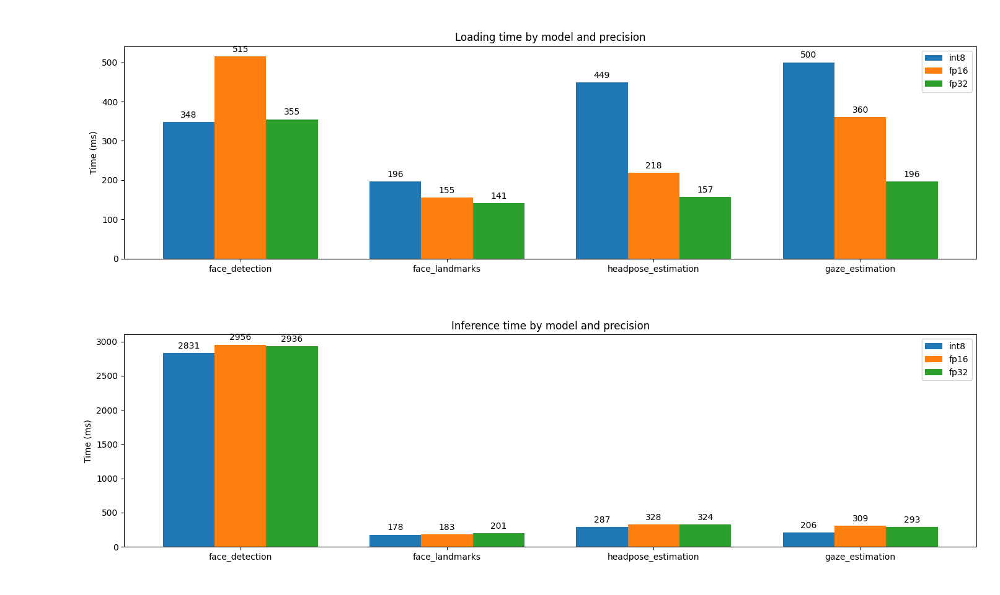

# Computer Pointer Controller

This project uses Gaze Estimation Model with openvino toolkit in Ubuntu 18.04.  
Perfomance measures have been applied to each model to compare every model precision available.

## Project Set Up and Installation

### Dependencies
This project have been done using openvino version 2020.02, which must be previously installed
and accessible from /opt/intel/openvino/ directory.

Virtualenv is required to create the python enviroment needed, it can be installed with:

    `python3 -m pip install --user virtualenv`

Also run `sudo apt-get install python3-tk` to install tkinter package needed to control the mouse in ubuntu.

### Preparing workspace
The steps to run the project are:

1. Unzip the compressed files or clone the project repository. 
2. From terminal cd to project directory
3. Run first bash script with:

    `./create_enviroment.sh`

    This will create the python venv and install required modules.

4. Run second bash script with:

    `./donwload_models.sh`

    This will download the required project models in project directory

5. To activate venv and openvino execute in terminal:

    `source /opt/intel/openvino/bin/setupvars.sh && source gaze_detection/bin/activate`

## Documentation
The main.py script have the following input parameters:

`--input_type`  
REQUIRED  
Type of streeming input, camera or recorded file.
OPTIONS "cam" or "video"

`--input_file`  
Path to video file to run inference when "video" input type is selected.

`--speed`  
Precision for mouse movement (how much the mouse moves)  
OPTIONS: "fast", "slow", "medium"

`--precision`  
How fast the mouse pointer moves  
OPTIONS: "high", "medium", "low"

`--model_precision`  
Refers to model precision available in pretrained IR.  
OPTIONS: "FP32", "FP16", "INT8"  
NOTES: Face detection only on FP32
       INT8 means "FP16-INT8"

`--display_values`  
Flag to display intermediate model outputs on screen
OPTIONS: "True" or "False"

## Demo
As example for running on camera run:

    `python main.py --input_type cam --precision low --speed fast --model_precision FP16 --display_values True`

It is posible to run the default video demo with:

    `python main.py --input_type video --input_file bin/demo.mp4 --precision high --speed fast --model_precision FP16 --display_values True`

## Benchmarks
Actually this project is running on ubuntu laptop (Corei7 10th GEN, 8 RAM)
The files with the benchmarks have been saved in the files:
"stats_INT8.csv", "stats_FP16.csv" and "stats_FP32.csv" located in the project directory

In this case the variables measured are:
Model loading time and Total (Accumulated) inference time for each model used.

NOTES: This perfomance have been measured using the demo video file located in bin/ directory.
       There won't be any difference for face detection model because there is only FP32 version available.

## Results
For better discussion of the results the files a graphication script can be used:

    `python graphs.py`

As this could change if you run the program, the results I got from my tests are this:

The time taken is small for both models, measured in miliseconds, as more of the time of the software is due the 
mouse movement speed.

About both metrics, we can find diferences in the model loading time for every model.
The models that takes more time to load are the INT8 and FP32 takes less, due the model steps and the
internal structure of the model.

The inference time shows how much time the models take to get the output,
this is important for deployments on the edge, being directly proportional to the processor load, 
in this case the INT8, is less computer expensive for every model and FP16 and FP32 get similar results, 
this show the time/precision tradeoff betwen models. 

## Stand Out Suggestions
-User can select from command line what input will be used for inference, Camera or Recorded Video File.

### Async Inference (Optional)
Not implemented.

### Edge Cases
About testing with several faces, the model takes as default the first one detected, 
avoiding any interference when controling the mouse.
